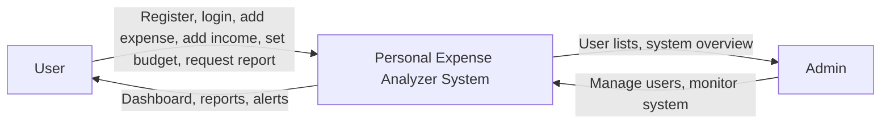
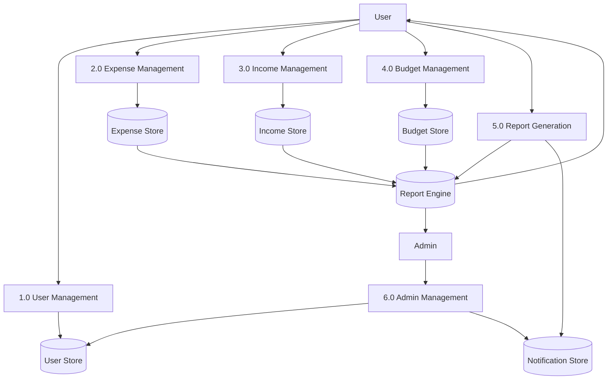

# Experiment 2: Data Flow Diagram

## Aim

To represent how data moves through the Personal Expense Analyzer system.

## Level 0 DFD

## Explanation

At Level 0, the entire application is shown as a single process. Users provide financial data and request reports, while the system responds with analytics, reports, and notifications. Administrators interact with the same system for monitoring and control.

## Level 1 DFD

## Explanation

The Level 1 DFD splits the system into the main processing modules. User registration and login flow through user management, financial entries are stored through expense and income modules, budgets are tracked independently, and reports combine stored data to create analysis and notifications.
