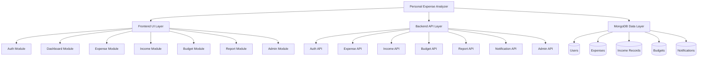

# Experiment 3: Structured Design

## Aim

To convert the DFD into a hierarchical module design for implementation.

## Module Hierarchy

## Module Description

- User Module: Handles registration, login, and session validation
- Expense Module: Stores, updates, and deletes expense records
- Income Module: Stores and manages income records
- Budget Module: Saves weekly and monthly limits and checks spending
- Report Module: Generates summaries, trends, and category analysis
- Notification Module: Sends alerts for budget limits and unusual activity
- Admin Module: Manages user roles and system-wide monitoring
- Database Module: Persists all core records in MongoDB

## Result

The project is structured into clear frontend, backend, and database layers with dedicated modules for each core responsibility.
