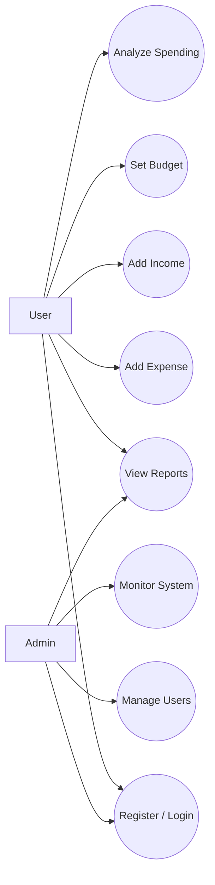

# Experiment 4: UML Use Case Model

## Aim

To identify actors and system interactions for the Personal Expense Analyzer.

## Actors

- User
- Admin

## Use Case Diagram

## Use Case Summary

### User

- Register or log into the system
- Add and manage expense entries
- Add and manage income records
- Set weekly or monthly budgets
- View reports and analyze spending trends

### Admin

- Log into the system
- Review reports and system health
- Manage users and roles
- Monitor usage activity
