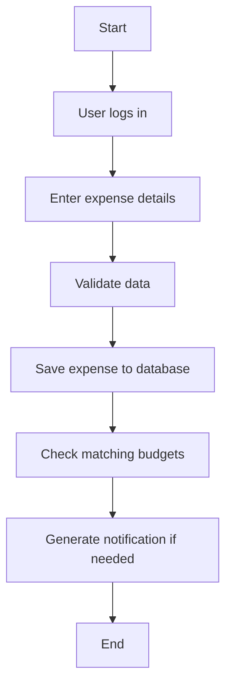
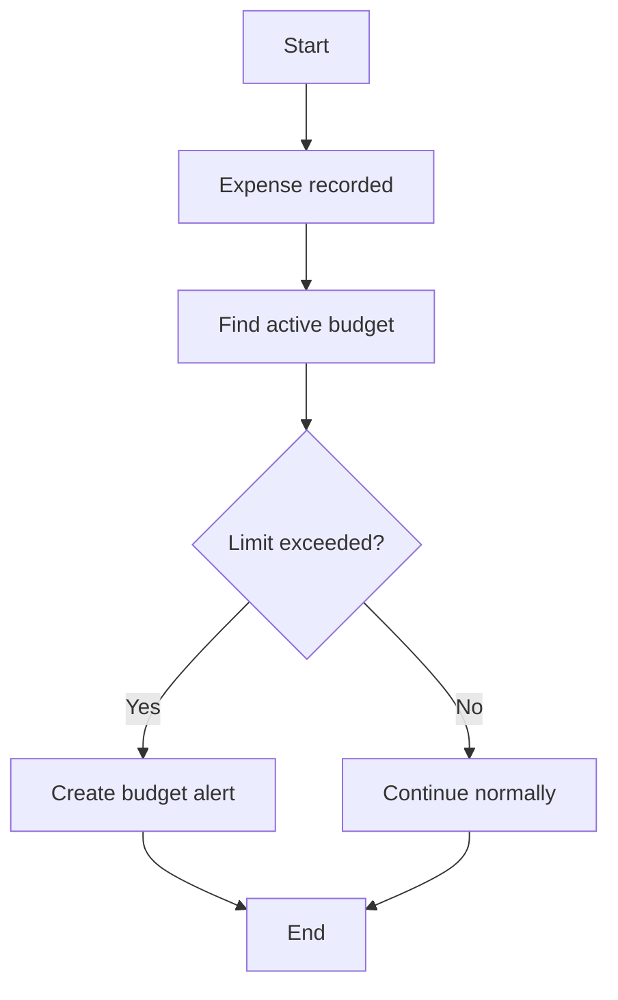
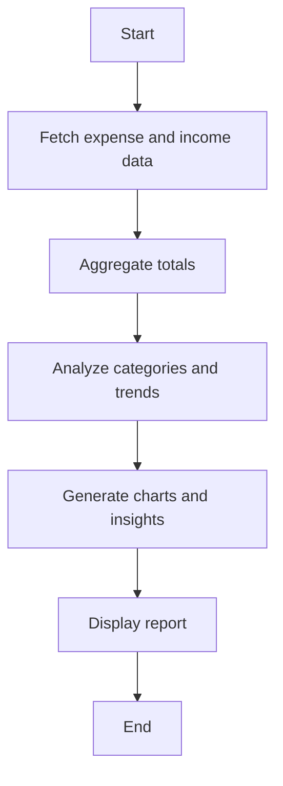
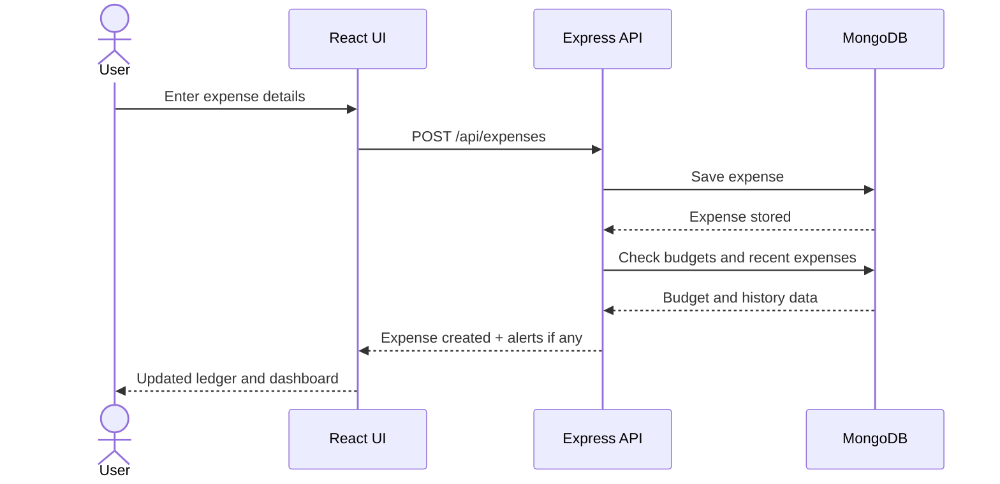
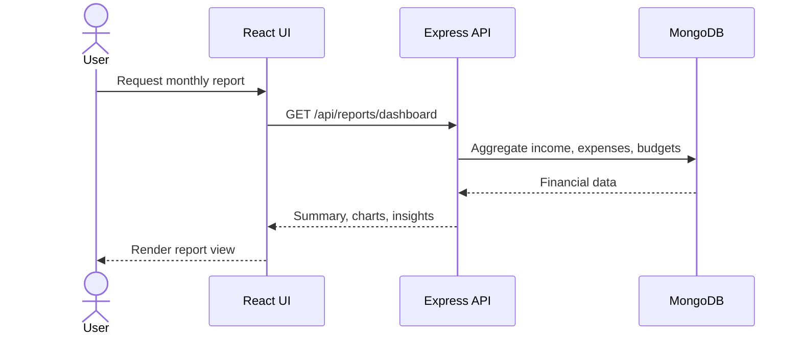
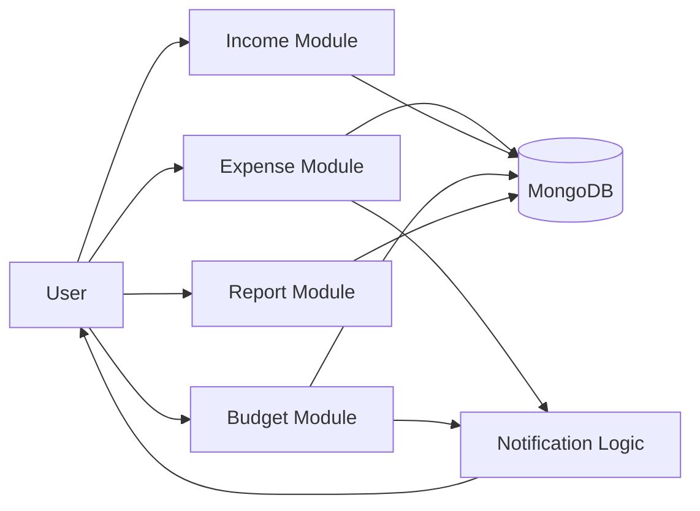

# Experiment 5: UML Behavioral Diagrams

## Use Case: Add Expense

- Precondition: User is logged in
- Flow: User enters expense details, system validates input, expense is stored, budget is checked
- Post-condition: Expense is saved and notifications may be generated

## Activity Diagram: Add Expense

## Activity Diagram: Budget Check

## Activity Diagram: Generate Report

## Sequence Diagram: Add Expense

## Sequence Diagram: View Report

## Collaboration Diagram

