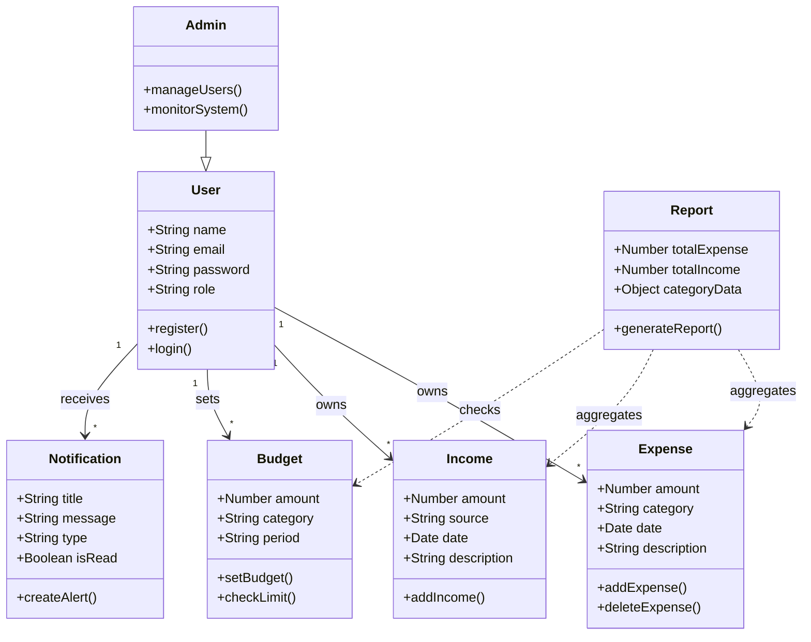
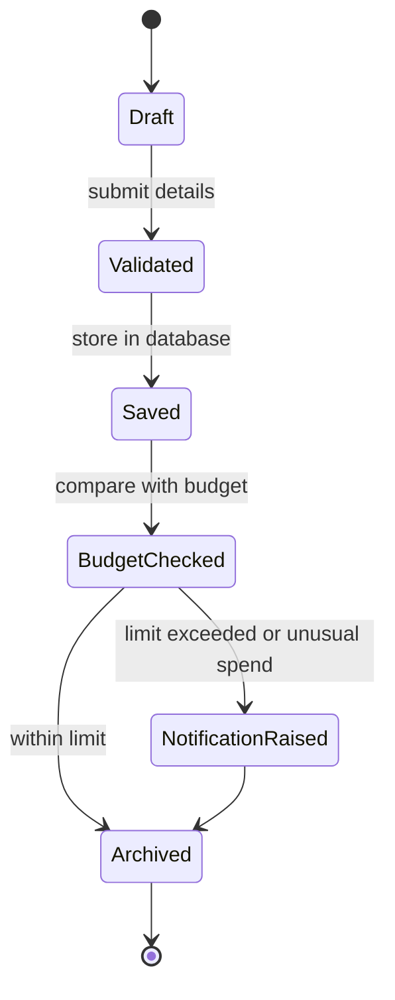

# Experiment 6: Class and State Diagrams

## Class Diagram

## State Diagram: Expense Lifecycle

## Result

The class diagram defines the structure of the system entities, while the state diagram shows how an expense record moves through validation, storage, budget checking, and alert generation.
